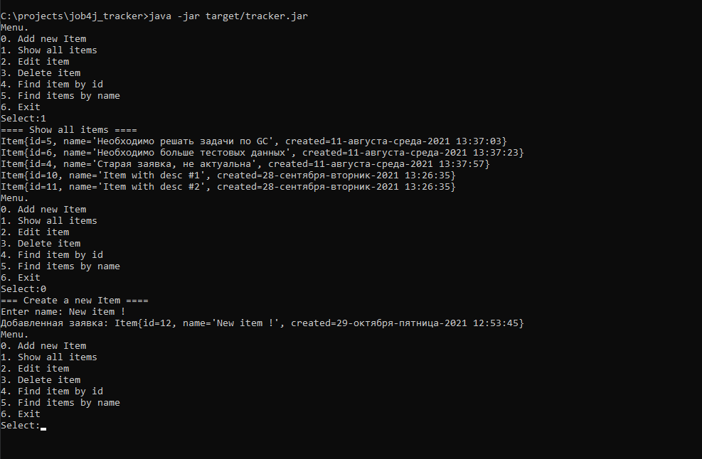

# job4j_tracker

+ [О проекте](#0-проекте)
+ [Технологии](#Технологии)
+ [Сборка и запуск](#Сборка-и-запуск)
+ [Использование](#Использование)
+ [Контакты](#Контакты)

## О проекте

Этот проект представляет собой базовое консольное приложение CRUD и демонстрирует принципы ООП. Для хранения данных 
используется Hibernate.

## Технологии

+ Сборщик проектов **Maven**;
+ Backend - **Java 14**, **JDBC**;
+ Для хранения данных используется фреймворк - **Hibernate**;
+ СУБД - **PostgreSQL**;
+ Непрерывная интеграция - **Travis CI**;
+ Тесты - **JUnit 4**;
+ Покрытие кода тестами - **Codecov**;
+ Инструмент для анализа стиля кода - **Checkstyle**;

## Сборка и запуск

### Запуск через терминал

1.Собрать jar через Maven

`mvn install -Dmaven.test-skip=true`

2.Запустить jar файл

`java -jar target/tracker.jar`

### Запуск через IDE

Перейти к папке `src/main/java` и файлу `ru.job4j.tracker.StartUI`

## Использование

## Контакты

Становов Семён Сергеевич

Email: sestanovov@gmail.com

Telegram: [@stanovovss](https://t.me/stanovovss)